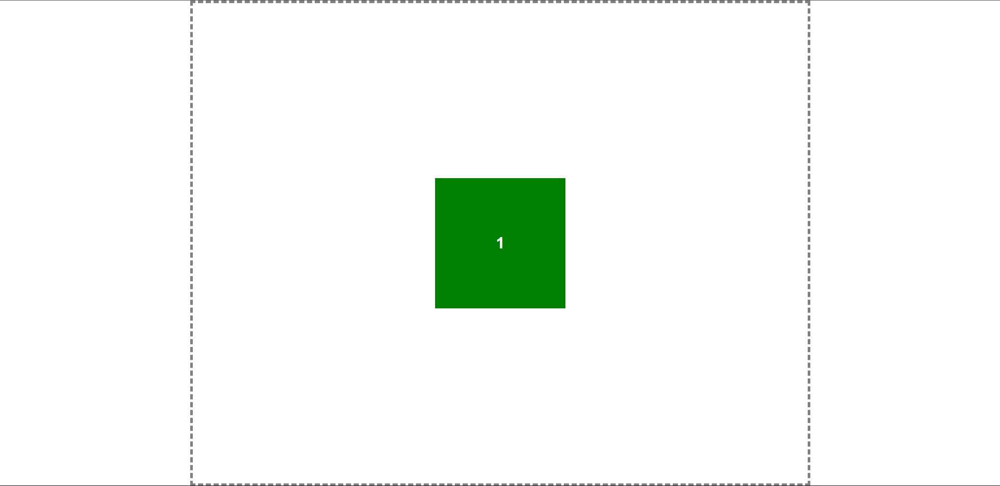
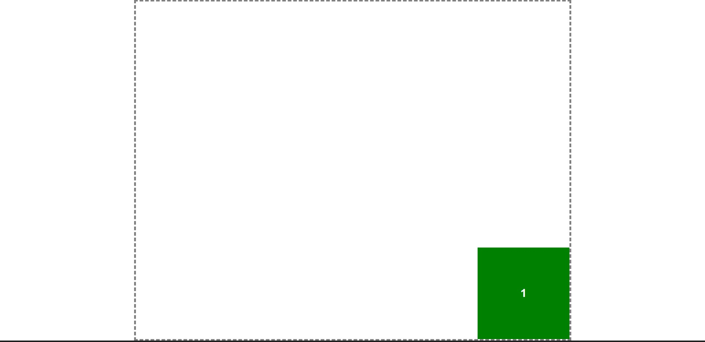
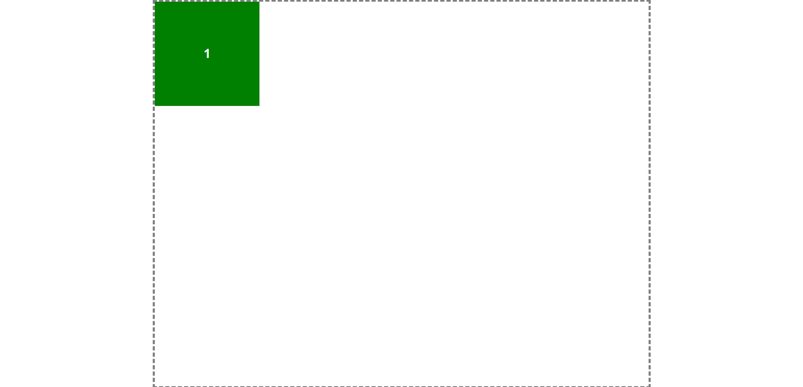
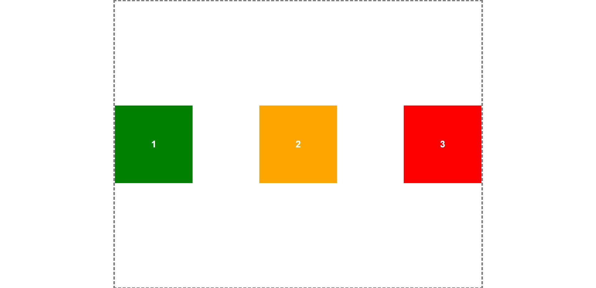
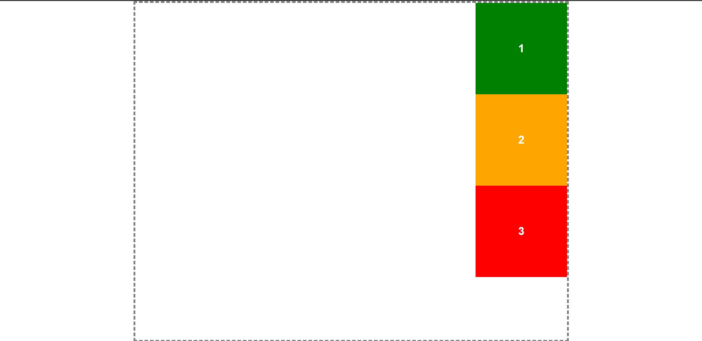
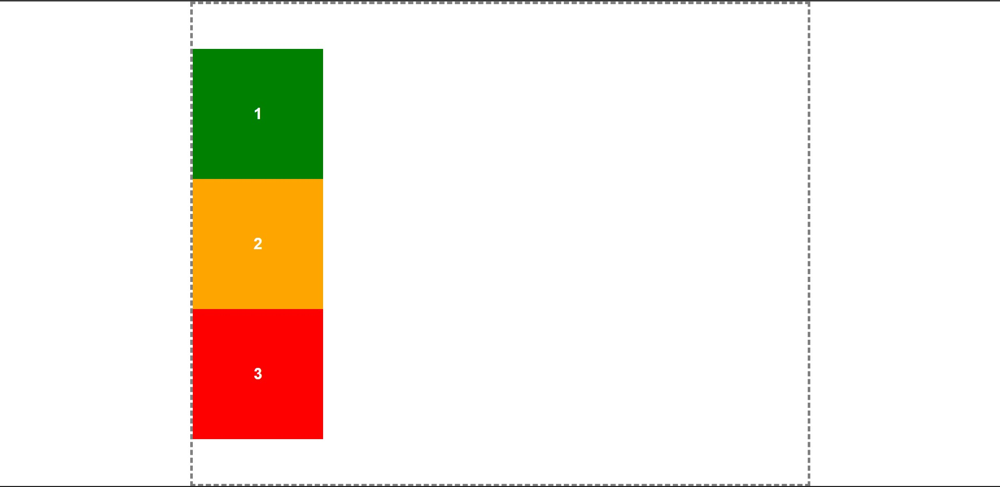
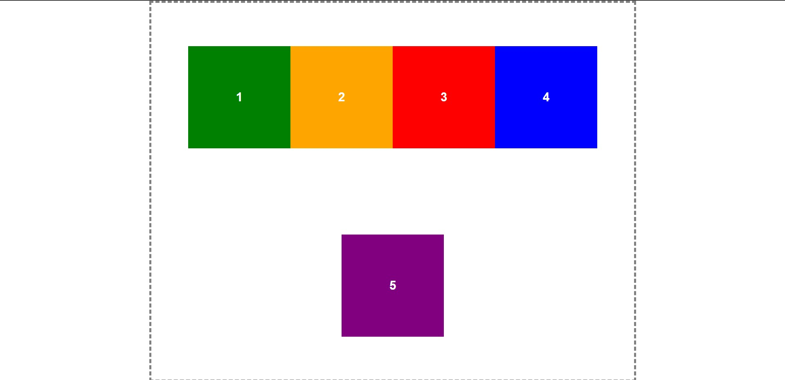
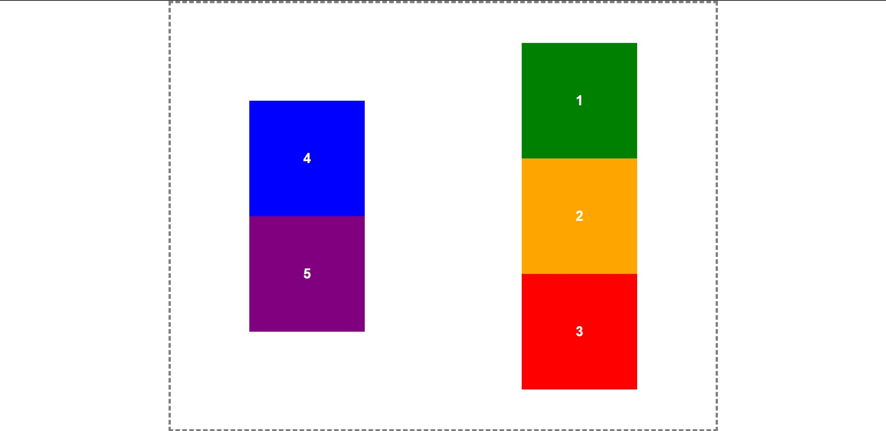

# Выравнивание элементов с помощью FlexBox
Для выполнения задания, вам могут пригодиться следующие свойства FlexBox:
* [align-items](https://webref.ru/css/align-items)
	* flex-start (по умол.)
	* flex-end
	* center
* [justify-content](https://webref.ru/css/justify-content)
	* flex-start (по умол. )
	* flex-end
	* center
	* space-between
	* space-around
* [flex-direction](https://webref.ru/css/flex-direction)
	* row (по умол.)
	* row-reverse
	* column
	* column-reverse
* [flex-wrap](https://webref.ru/css/flex-wrap)
	* nowrap (по умол.)
	* wrap
	* wrap-reverse

> Не забывайте, что при использовании **flex-direction: column;** свойства align-items и justify-content меняются местами. Если раньше align-items выравнивало по вертикали, а justify-content по горизонтали, то теперь, align-items будет выравнивать по горизонтали, а justify-content по вертикали, поскольку все элементы теперь расположены в колонку.

## Следующие задания необходимо выполнить с одной карточкой. Оставьте первую (зеленую), а остальные закомментируйте
1. Выровняйте зеленую карточку по центру страницы. Как должно получиться: 
2. Выровняйте зеленую карточку справа снизу от контейнера. Как должно получиться: 
3. Выровняйте зеленую карточку слева сверху от контейнера, с помощью свойств FlexBox. Как должно получится: 

## Следующие задания необходимо выполнить с 3 карточками: 1, 2, 3
1. Выровняйте карточки по центру и распределите их равномерно от левого края к правому. Пример: 
2. Сделайте направление карточек в столбик и распределите их справа сверху от контейнера. Пример: 
3. Сделайте направление карточек в столбик и распределите их слева по центру от контейнера. Пример: 

## Следующие задания необходимо выполнить со всеми (5) карточками
1. Выровняйте все карточки по центру контейнера и, если какие-то из них не влезают, сделайте так, чтобы они переносились на другую строку. Пример: 
2. Выровняйте все карточки по центру контейнера, задайте направление в колонку. Если какие-то из них не влезут в контейнер, перенесите их в другую колонку. Причем, перенос у вас должен осуществляться в другую сторону. Пример 