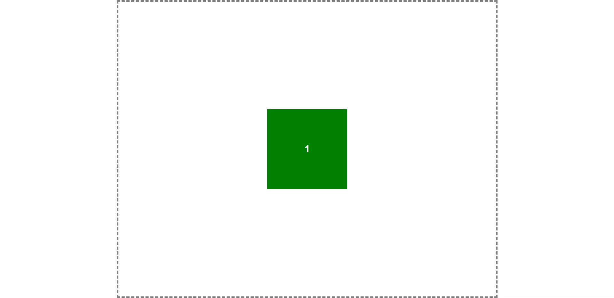

# Выравнивание элементов с помощью FlexBox
Для выполнения задания, вам необходимо использовать свойства FlexBox:
* align-items
	* flex-start (по умол.)
	* flex-end
	* center
* justify-content
	* flex-start (по умол. )
	* flex-end
	* center
	* space-between
	* space-around

## Следующие задания необходимо выполнить с одной карточкой. Оставьте зеленую, а остальные закомментируйте
1. Выровняйте зеленую карточку по центру страницы. Как должно получиться: 
2. Выровняйте зеленую карточку справа снизу от экрана. Как должно получиться: 
3. Выровняйте зеленую карточку слева сверху от экрана, с помощью свойств FlexBox. Как должно получится: 